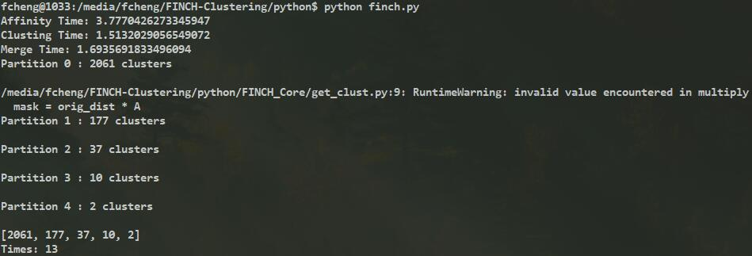

# FINCH-ClusteringPy
First Integer Neighbor Clustering Hierarchy (FINCH) Algorithm

The repository contains Python code for FINCH Clustering algorithm described in Efficient Parameter-free Clustering Using First Neighbor Relations CVPR 2019 paper.

## Usage:
c, num_clust = finch(data, initial_rank, verbose)

Input:

* data: features vectors (N X m, the feature has m dims)
* initial_rank [Optional]: Nx1 (1-neighbour) indices vector.
* verbose: 1 for printing some information.

Output:

* c: N x P matrix  Each column vector contains cluster labels for each partition P
* num_clust: shows total number of cluster in each partition P

Typically you would run:
```
c, num_clust = finch(data, [], 1)
```
**Example:** Cluster the STL-10 data (13000 images of 10 object classes. We provide the used 2048 CNN resnet features.
Please load the  data in python from /data/STL_10/data.mat. This has 13000 vectors stored as a matrix of size (13000,2048), each vector is 2048 dimensional.

Now cluster it using FINCH, run the above command with tic toc to see the runtime. The run time includes computing first neighbours via exact distance and every thing.

```
# load data
import h5py
import numpy as np
file_path = ".../data/STL-10/data.mat"

with h5py.File(file_path, 'r') as f:
    data = np.array(f['data'])

# run clustering
from .finchpy.finch import finch
c, num_clust = finch(data, [], 1)
```


**Evaluation**: haven't be implemented.